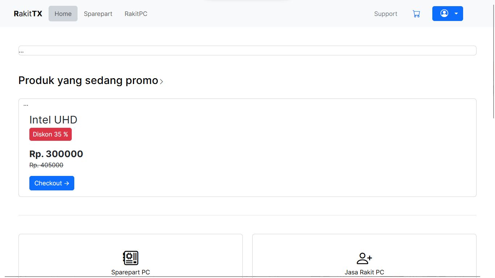
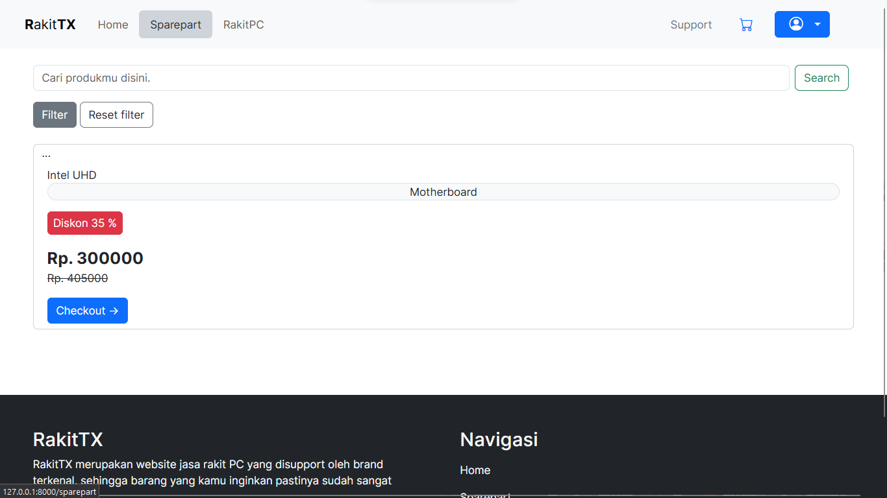
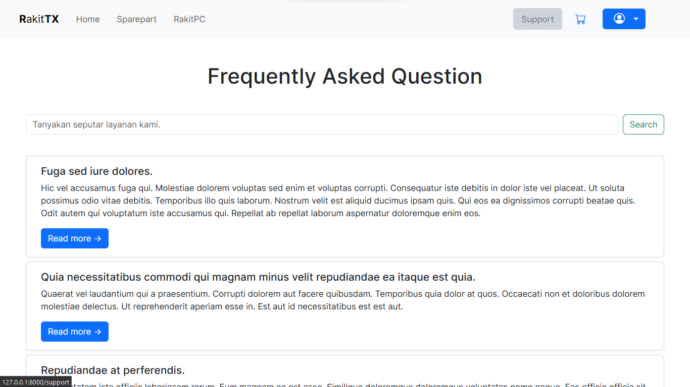

<div align="center">


</div>

## RakitTX
RakitTX is a simulation website that using laravel, php and bootstrap as core of the projects. Contains MVC and CRUD using MySQL Databases.

## Overview
<div align="center">

<br>

<br>

<br>

<br>
Check this website : rakittx.000webhostapp.com
</div>

## Getting Started
1. Clone this website at your directory.
```sh
git clone https://github.com/d1azdn/rakittx 
```
2. Download the package
```sh
composer install --no-dev
```
3. Run the builder (if input.css is gone, check on Tailwindcss official website.)
```sh
php artisan serve
```

## Contributor
- me
- laravel
- php
- bootstrap

## Images
You can see images below as showcase before i deployed the web.

##
<div align="center" style="display:flex; align-items:center; text-align:center; justify-content: center;">

<p style="font-size:25px">Hello.</p>
</div>
